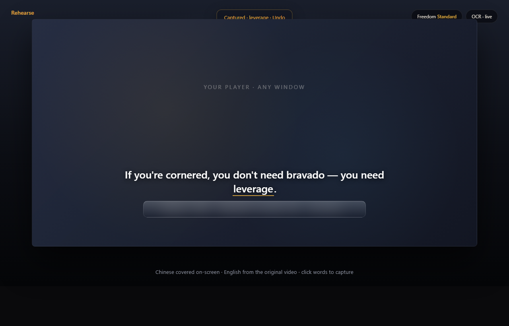
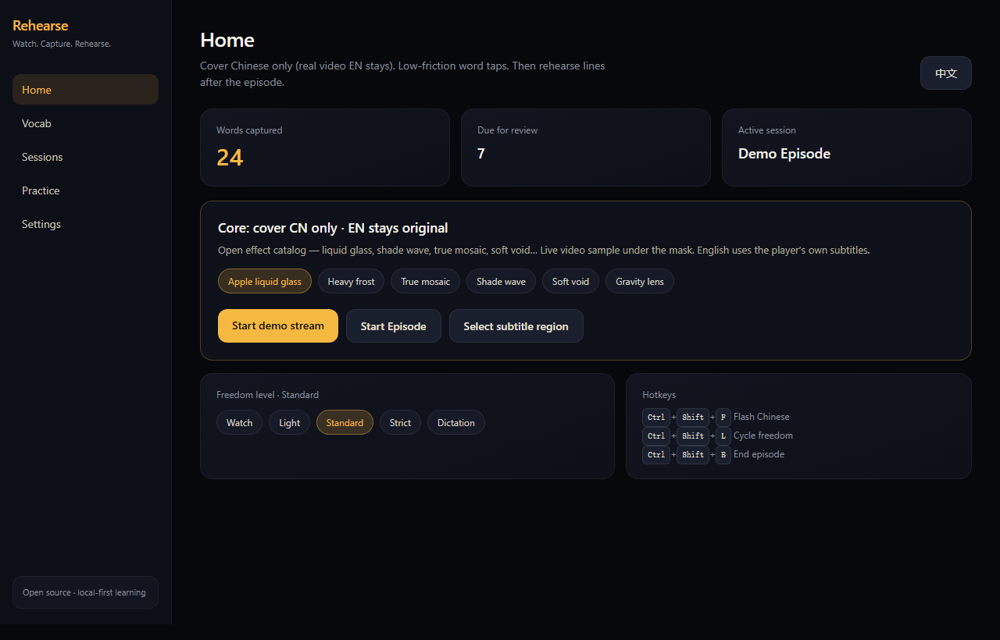
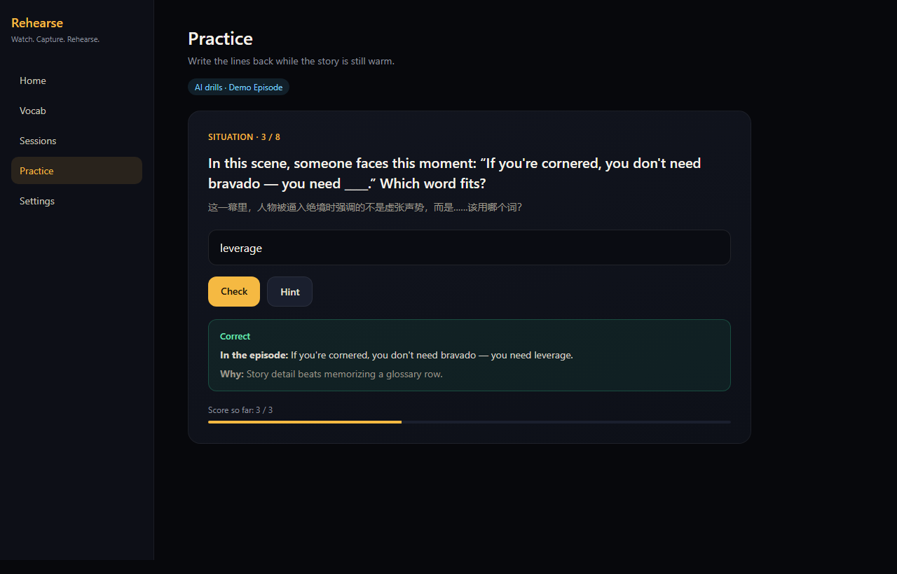

# Rehearse

**看剧学英语：挡住中文，留下英文，点词收录，看完再写回。**  
*Watch. Capture. Rehearse. — Learn English from any video player on Windows.*

<p align="center">
  <a href="https://github.com/Galloway0303/rehearse/releases/latest"></a>
  &nbsp;
  <a href="https://github.com/Galloway0303/rehearse/releases/latest"></a>
</p>

<p align="center">
  
  
  
</p>

<p align="center">
  <a href="#下载安装不用写代码">下载</a> ·
  <a href="#这是什么">是什么</a> ·
  <a href="#为什么值得用">优势</a> ·
  <a href="#怎么用">怎么用</a> ·
  <a href="#边界你需要知道">边界</a> ·
  <a href="#for-developers">Dev</a> ·
  <a href="CHANGELOG.md">Changelog</a>
</p>

---

## 下载安装（不用写代码）

> **不会 Git / 不会 Node 也能用。** 只要 Windows 电脑。

### 三步

1. 打开 → [**最新 Release 下载页**](https://github.com/Galloway0303/rehearse/releases/latest)  
2. 在页面底部 **Assets** 里下载其中一个：  
   - **`Rehearse.Setup.1.1.0.exe`** — 安装版（推荐，有安装向导）  
   - **`Rehearse.1.1.0.exe`** — 绿色便携版，下载后直接双击  
3. 运行后第一次可先点 **Demo 演示**，不用开视频也能走通流程。

<p align="center">
  <a href="https://github.com/Galloway0303/rehearse/releases/latest">
    
  </a>
</p>

<details>
<summary><b>下载页上暂时没有 .exe？</b></summary>

<br>

当前若 Release 只有说明文字、没有安装包，说明还在打包上传。你可以：

- 看 [Releases](https://github.com/Galloway0303/rehearse/releases) 里带 **Assets** 附件的版本  
- 或让会代码的朋友按下方 [For developers](#for-developers) 本地 `npm run dist` 打一份  

</details>

**系统：** Windows 10 / 11（64 位）  
**可选：** 在设置里填 [xAI API Key](https://console.x.ai) 才能用 AI 释义/出题；不填也能用离线模板。

---

## 这是什么

你看剧时，字幕经常是 **英文 + 中文** 两行。中文一出现，眼睛就会偷懒，英语听不进去。

**Rehearse 不接管你的播放器**（Netflix、浏览器、PotPlayer、本地视频都可以）。  
它只做一件事：在屏幕上框住字幕区——

1. **挡住中文**（马赛克 / 玻璃 / 暗波等特效）  
2. **英文原片字幕还在**，继续读、继续听  
3. **点词收录**，看完再用情景题 **写回台词**

像给「看剧」加了一层轻度训练，而不是再开一个学习 App 做题。

<p align="center">
  
</p>

| 控制台 | 写回练习 |
|--------|----------|
|  |  |

---

## 为什么值得用

| | 一句话 |
|--|--------|
| **不绑平台** | 不靠 Netflix 插件。任何能放视频的窗口都行。 |
| **只挡中文** | 英文仍是片子上的那一行，不是软件盖一层假字幕。 |
| **摩擦可调** | 从「随便看」到「几乎不给中文」五档，默认适中。 |
| **Pip 煤球** | 暂停弹出小煤球，当前句单词一点就查，短释义 + 词根。 |
| **看完再练** | 本集词库可练习、可导出 CSV / Anki 文本。 |
| **数据在本地** | 默认不上传你的生词和剧集记录。 |

**和浏览器插件（如 Language Reactor）差在哪？**  
插件吃的是网页里的「软字幕」。Rehearse 吃的是 **屏幕画面**——本地播放器、嵌入字幕、没有扩展的页面，也能用。代价是识别会受清晰度影响，所以提供 Demo 和调框。

---

## 怎么用

用自然语言走一遍就行：

1. **打开 Rehearse** → 先 Demo 熟悉，或点「框选字幕区域」  
2. **框住中英文字幕那一块**（中文在上/在下按你片源调）  
3. **选自由度**（推荐 Standard）→ 开始本集  
4. **正常看剧** → 想查词就暂停，点煤球或词条  
5. **结束本集** → 进练习，写回几句台词  

### 常用快捷键

| 按键 | 作用 |
|------|------|
| `Ctrl+Shift+P` | 暂停学习（抬遮罩、方便选词） |
| `Ctrl+Shift+F` | 闪一下中文 |
| `Ctrl+Shift+Q` | **退出应用**（遮罩一起关） |
| `Ctrl+Shift+M` | 打开控制台窗口 |

关控制台窗口时，若遮罩还在，程序可能只是藏到托盘——要彻底关掉用 **`Ctrl+Shift+Q`** 或托盘 → 退出。

---

## 边界（你需要知道）

- **只支持 Windows**（暂无 Mac / Linux）  
- **OCR 会看错、会粘词**——框准、字够大、对比够会好很多  
- **不会破解 DRM**，也不绕过会员；只处理你本来就能看的画面  
- **AI 要自己的 Key**；不配也能用基础功能  
- **开源 MIT**：可自用、可改、可商用；作者不保证 7×24 客服  

更细的变更见 [CHANGELOG](CHANGELOG.md)。安全问题见 [SECURITY.md](SECURITY.md)。

---

## 语言说明 · Language

- **界面：** 应用内可切换 **中文 / English**  
- **本页：** 中文为主（方便国内同学一眼看懂）+ 关键英文摘要  
- **代码 / Issue：** 中英文都行；提 bug 附截图最有用  

**English summary:** Rehearse is a Windows app that covers *Chinese* subtitles on any player while keeping *English* readable, lets you tap words (Pip pet), and rehearse lines after the episode. Local-first. [Download latest release](https://github.com/Galloway0303/rehearse/releases/latest).

---

## For developers

```bash
git clone https://github.com/Galloway0303/rehearse.git
cd rehearse
npm install
npm run electron:dev:stable   # Windows 推荐
```

打安装包：

```bash
npm run dist
# 产物在 release/ ：安装包 + portable
```

国内拉 Electron 失败时：

```bat
set ELECTRON_MIRROR=https://npmmirror.com/mirrors/electron/
npm install
```

| 目录 | 做什么 |
|------|--------|
| `electron/` | 主进程：窗口、OCR、IPC、AI、存储 |
| `src/renderer/` | 控制台 UI |
| `src/mask/` | 中文遮罩特效 |
| `src/pet/` | 煤球 Pip |
| `src/shared/` | 类型、i18n |

贡献说明：[CONTRIBUTING.md](CONTRIBUTING.md) · 跑一下 `npm run typecheck` 再提 PR 更好。

---

## License

[MIT](LICENSE) © Rehearse contributors
